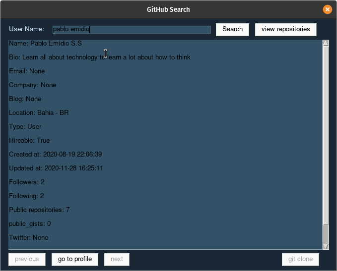

<h1 align="center">GitHubSearch</h1>

A simple GUI to search <strong>GitHub's profiles</strong> and to see <strong>yours repositorires</strong> 

<h2 align="center">
  
  
</h2>

# ⚈ About
This is a program for searching GitHub's profiles using GitHub's API; It was made to facilitating dev's search for profiles informations.
Now just knowing the name, you'll have profiles and repositories's informations of people that you'd like searching.

## Some Screenshots

<h1 align="center">
  <h4>Searching for profile</h3>
   
  <h4>Taking repositorie's informations</h3>
   
</h1>

# ⚈ Tech Stack

The following tools were used in the construction of the project:

- [Python](https://www.python.org/)
- [PySimpleGUI](https://pysimplegui.readthedocs.io/en/latest/cookbook/)
- [json](https://www.json.org/json-pt.html)

<h1>⚈ Bugs</h1>

Please report any type of bug. Remember that this is an open source project and will evolve with everyone's help. :) 
Any report will be read and will get due attention

 

New features are being done and new ideas are being created always that possible... 
new ideas will be accepted...

 

GitHub has a limit for requests, then uses with prudence

